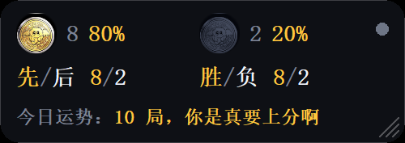
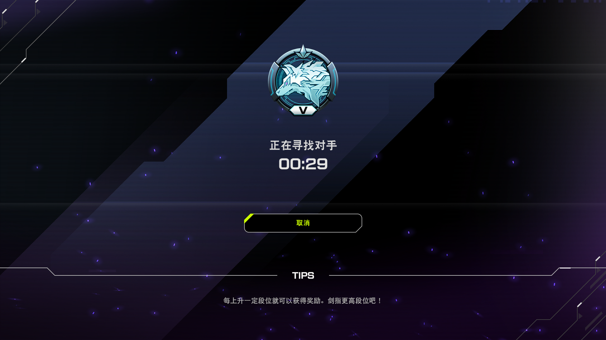
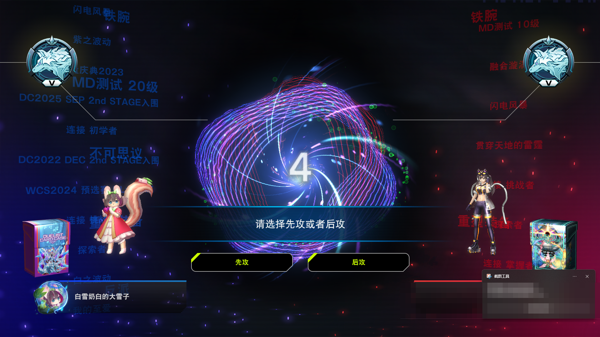
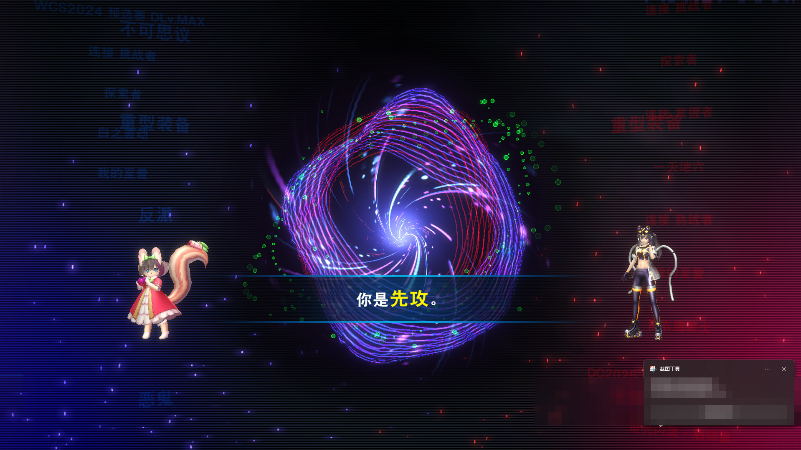
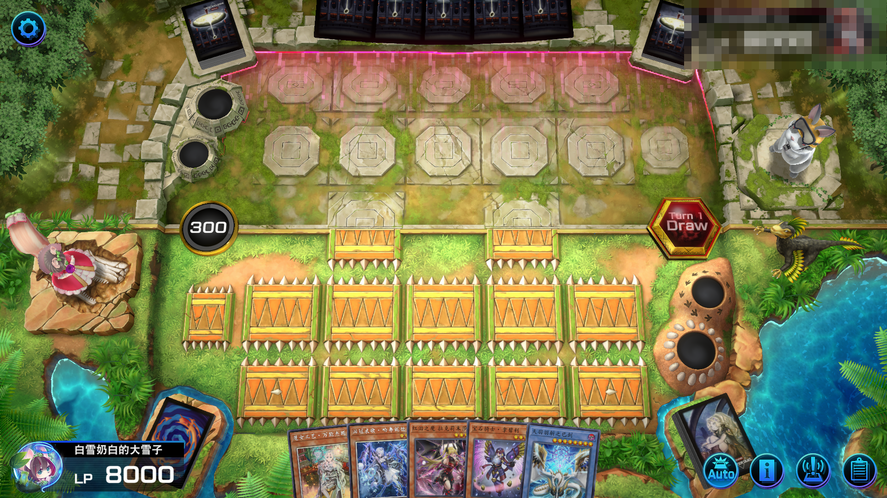

# Yu-Gi-Oh MDCoinWatch

大师决斗的投币运势小浮窗。后台看屏幕，记录每局的**投币胜负**和**实际先后手**，顺手给你一句今日运势。

不注入、不改内存、不读游戏进程、不碰网络，只截取几个固定的屏幕小区域做模板匹配。

**A tiny always-on-top overlay for Yu-Gi-Oh! Master Duel.** It watches a few fixed screen regions and records, duel by duel, whether you won the coin toss and who actually goes first — then shows a daily luck line. Screen-reading only: no memory access, no input injection, no network. Chinese UI for now.

## 下载

去 [Releases](../../releases) 拿最新的 exe：

| 文件 | 大小 | 说明 |
| --- | --- | --- |
| `YuGiOh-MDCoinWatch.exe` | 约 11 MB | 自带运行时，双击就能跑，换台机器也不用装东西 |
| `YuGiOh-MDCoinWatch-lite.exe` | 约 0.8 MB | 需要先装 .NET 8 运行时，启动更快 |

丢进单独一个文件夹再运行，它会在 exe 旁边生成 `duel_stats.csv`、`YuGiOh-MDCoinWatch.ini`、`YuGiOh-MDCoinWatch.log`。

> 仓库里**不含游戏截图**（截图里有玩家 ID），所以 `--selftest` / `--replay` 要指向你自己的截图才能跑。



## 界面

一个无边框悬浮小窗，默认贴在屏幕右上角，可以拖。

- **左上金币 + 次数 + 百分比**：今天硬币正面（= 投币猜赢，自己选先后手）的次数和比例
- **右上黑币 + 次数 + 百分比**：反面（= 被对手选走）的次数和比例
- **先手 / 后手**：今天先攻、后攻的局数
- **今日运势**：按正面率分档的文案；连正 / 连负会触发彩蛋
- **右上角小圆点**：绿 = 已锁定游戏，黄 = 对局中，灰 = 等游戏
- **右下角三道斜线**：缩放把手

拖浮窗**边缘**是等比缩放（宽度 240~720），拖**中间**是移动。右键菜单里的「大小」还有四档预设，「锁定位置与大小」勾上就固定住。

**右键菜单**：文字颜色、强调色、不透明度、锁定位置、打开记录文件、打开配置与日志、退出。

浮窗带 `WS_EX_NOACTIVATE`，**点它不会抢焦点**，游戏始终是前台窗口，所以去点浮窗不会让识别暂停。

> 浮窗是画在屏幕上的。如果拖到识别区上面，会读到浮窗自己 —— 程序检测到会显示「浮窗挡住「xxx」」并暂停识别。默认的右上角是安全的。

## 游戏里的样子

完整的 11 张在 [docs/screenshots](docs/screenshots)（对手名字已打码）。

 
 

## 怎么跑

1. 游戏分辨率设成 **16:9**（1600x900 / 1920x1080 / 2560x1440 都行），用**窗口**或**无边框窗口**
2. 双击 `dist\MdCoinWatch.exe`
3. 切回游戏正常打
4. 打完看浮窗，或者打开 exe 同目录的 `duel_stats.csv`

第一次跑如果一直显示「等待游戏」：确认游戏已经开着；进程名不是 `masterduel` 的话，改 `YuGiOh-MDCoinWatch.ini` 里的 `process=`。

程序只在游戏处于前台时识别。切出来看数据时会显示「切回游戏」，切回去自动继续。

## 注意事项

**必须要满足的**

1. **游戏用窗口或无边框窗口，别用独占全屏。** 独占全屏下抓屏会拿到黑帧，程序检测到会提示「抓到纯色」并停在那里。
2. **分辨率用 16:9**（1600x900 / 1920x1080 / 2560x1440 都行）。不是 16:9 会写日志提示，识别位置会偏。
3. **浮窗不能压在识别区上。** 要读的是屏幕中下部那一条横带（1600x900 下大约 x 560~1040、y 570~755）。压住会被状态提示「浮窗挡住「xxx」」并暂停识别。默认的右上角是安全的。
4. **识别只在游戏处于前台时进行。** 切出来看数据时会显示「切回游戏」并暂停，切回去自动继续 —— 这是故意的，否则会读到别的窗口。
5. 点浮窗、拖它、缩放它**都不会抢走游戏焦点**。右键菜单里有「锁定位置与大小」，防止误碰。

**Windows 会拦你一下**

6. exe 没有代码签名，从网上下载后首次运行，SmartScreen 会弹「已阻止……未知发布者」。点「更多信息」→「仍要运行」。杀毒软件也可能误报，加个信任即可。
7. 首次运行会在 exe 旁边生成 `duel_stats.csv`、`YuGiOh-MDCoinWatch.ini`、`YuGiOh-MDCoinWatch.log`。**建议单独放一个文件夹**，别丢在桌面或下载目录里和一堆文件混着。

**数据与隐私**

8. 程序**不联网**、不写注册表、不读其他进程的内存。它只做两件事：截几个固定的屏幕小区域，往旁边的 CSV 追加一行。
9. CSV 只记时间、投币胜负、先后手、对局秒数。不记对手是谁、不记卡组、不记你的账号。
10. 仓库里的示例截图**已抹掉对手的玩家名**，你自己那一侧保留。

**其他**

11. 目前只有简体中文界面。
12. 只统计**今天**的记录，跨天重新计数，历史都在 CSV 里。
13. 先后手横幅只闪一两秒。如果日志里反复出现「没捕捉到横幅」，把 ini 里的 `fps` 从 10 提到 20。

## 识别什么

| 事件 | 判据 | 位置（1920x1080 基准） | 实测分离度 |
| --- | --- | --- | --- |
| 投币 = 正面 | 两个按钮文字变黄 + 选择行文字匹配 | 两个 110x36 按钮框；选择行 360x44 | 1.000 / 次高 0.209 |
| 投币 = 反面 | 按钮不黄 + 等待行文字匹配 | 等待行 560x44 | 1.000 / 次高 0.320 |
| 先攻 / 后攻 | 「先攻」「后攻」两个字，两模板取 argmax | 100x52 | 1.000 / 交叉 0.634 |
| 对局结束 | 结束画面三按钮整行 | 555x125 | 1.000 / 次高 0.237 |

顺序是**先定屏、再判内容**：投币以「按钮在不在」为主判据，文字只做二次确认。对局中画面在同一批 ROI 上会误报（按钮框里有 2335 / 1965 个黄色像素），必须靠选择行 / 等待行的文字挡掉。

全部匹配用灰度 TM_CCOEFF_NORMED，固定位置 ±4 px 搜索（粗搜步长 2 再精搜步长 1），实测 10 fps 下每帧 2.5 ms、单核占用 2.5%。

## 状态机

```
空闲 ──看到选择界面 / 等待界面──> 已判投币 ──看到先攻 / 后攻横幅──> 对局中 ──看到结束画面──> 补上时长 ──> 空闲
                                    │                                    │
                                    └── 25 秒没等到横幅，先后手记空 ─────┘
                                                                         └── 45 分钟没结束，按超时记录
```

记录是在**开局那一刻**写的：看到先后手横幅（或者等不到横幅超时）就写一行 CSV、浮窗数字立刻更新；看到结束画面只是把同一条记录补上时长，不会再插一行。

只有当前状态需要的判据才会跑，空闲时只看两个小按钮框。

## 两套打包

| 版本 | 位置 | 大小 | 依赖 |
| --- | --- | --- | --- |
| 框架依赖 | `dist\` | 约 0.8 MB | 需要 .NET 8 运行时 |
| 自带运行时 | `dist-standalone\` | 约 11 MB | 无，换台机器直接跑 |

说明：界面是**纯 Win32 + GDI 自绘**，没用 WinForms —— 只有这样自带运行时版才能靠 `PublishTrimmed` 裁到十几 MB（WinForms 不支持裁剪，会直接报 NETSDK1175，体积卡在 60 MB 以上）。自带运行时的单文件靠 `IncludeNativeLibrariesForSelfExtract` 把本机库一起塞进 exe，首次运行会自解压。

```powershell
.\build.ps1                 # 出小包
.\build.ps1 -Both           # 两个都出
.\build.ps1 -Assets         # 先从截图重新生成模板和硬币图标
```

## 配置

`YuGiOh-MDCoinWatch.ini` 在 exe 旁边，改完重启生效。

```ini
textColor=#EEF2F8       # 正文字色
accentColor=#FFC53D     # 百分比和运势的字色
dimColor=#7C8496        # 次要文字色
panelColor=#0E1015      # 面板底色
opacity=92              # 面板不透明度 25~100
x=-1                    # 浮窗位置，-1 = 自动放右上角
y=-1
csv=duel_stats.csv      # 记录文件，可写绝对路径
width=300               # 浮窗宽度 240~720，高度按比例
process=masterduel      # 游戏进程名前缀
fps=10                  # 每秒抓帧次数
```

颜色也可以在右键菜单里改，改完自动写回这个文件。

## 命令行

界面是主入口；这几个是排查用的，**输出要接管道才看得到**（程序是 WinExe，靠 AttachConsole 挂到调用者的控制台）：

```powershell
.\dist\YuGiOh-MDCoinWatch.exe --list                    | Out-String
.\dist\YuGiOh-MDCoinWatch.exe --selftest=. --size=1600x900 | Out-String
.\dist\YuGiOh-MDCoinWatch.exe --replay=. --csv=test.csv     | Out-String
```

| 参数 | 作用 |
| --- | --- |
| `--list` | 列出当前所有可见窗口和进程名 |
| `--selftest=目录` | 离线跑目录里的截图，打印全部匹配分数 |
| `--replay=目录` | 用样本截图按顺序跑一遍状态机，验证记录链路 |
| `--size=1600x900` | 配合 selftest / replay，按指定客户区尺寸缩放后再判 |
| `--csv=路径` | 指定输出文件 |
| `--process=名字` | 指定进程名 |
| `--help` | 帮助 |

## CSV 格式

```csv
time,coin,turn_order,duel_seconds,note
2026-10-02 21:10:00,LOSE,SECOND,40,结束画面出现
2026-10-02 21:11:00,WIN,FIRST,43,结束画面出现
```

- `coin`：`WIN` = 投币猜赢；`LOSE` = 被对手选走
- `turn_order`：`FIRST` / `SECOND`；没捕捉到横幅时为空
- `duel_seconds`：从先后手横幅到结束画面的秒数。开局时这格是空的，打完才补上
- `note`：记录原因

文件带 UTF-8 BOM，Excel 双击不会乱码。浮窗只统计**今天**的记录。

## 已验证 / 未验证

**已验证**：

- 11 张样本截图离线自检全部判对、零误报
- 三种客户区尺寸：1600x900 / 1920x1080 / 2560x1440，真实命中 0.968 ~ 0.991，误报最高 0.366
- 整链路回放：赢投币走先攻、输投币走后先两局，状态机走出正确记录
- 开局落记录、结束补时长：回放日志里 `[记录]` 出现在先后手那一步，`[更新]` 出现在结束画面
- 实机跑过，`duel_stats.csv` 里已有真实记录
- 实时抓屏实测 10 fps 每帧 2.5 ms
- 浮窗渲染、统计读取、双版本打包都跑过
- 原生自绘版与 WinForms 版渲染对比过，观感一致

**需要你实测**：

- 浮窗点上去不抢焦点（这块只能实机确认）
- 先后手横幅只出现一两秒，够不够抓。日志里反复出现「没捕捉到横幅」的话，把 ini 里的 `fps` 提到 20
- VICTORY 那张（样本里只有 DEFEAT，判据不看胜负文字，理论上不受影响）

**已知限制**：

- 只做简体中文界面
- 只做 16:9；客户区不是 16:9 会写日志提示
- 独占全屏可能抓到黑屏；窗口 / 无边框窗口没问题
- 不判对局胜负

## 目录结构

```
app/                      C# 源码
  templates/*.bin         内嵌识别模板（120 KB，从截图裁的灰度图）
  assets/*.bgra           界面用的预乘 alpha 硬币位图
  assets/*.png app.ico    硬币素材和程序图标
  legacy/                 早先的 WinForms 版界面，留着备查，不参与编译
tools/make_templates.py   从截图重新生成识别模板
tools/make_coin_assets.py 从截图抠硬币图标、生成 ico
probe/                    可行性分析与离线验证脚本
docs/widget.png           README 用的界面图
docs/screenshots/         游戏截图（对手名字已打码）
build.ps1                 构建脚本
可行性报告.md              可行性分析报告
```

## 重新生成资源 / 重新验证

游戏更新改了 UI 之后：

```powershell
.\build.ps1 -Assets
.\dist\YuGiOh-MDCoinWatch.exe --selftest=. | Out-String
.\dist\YuGiOh-MDCoinWatch.exe --replay=. --csv=test.csv | Out-String
```

## 声明

非官方工具，仅读取屏幕像素，不修改游戏、不模拟输入。游戏素材版权归 KONAMI 所有。
